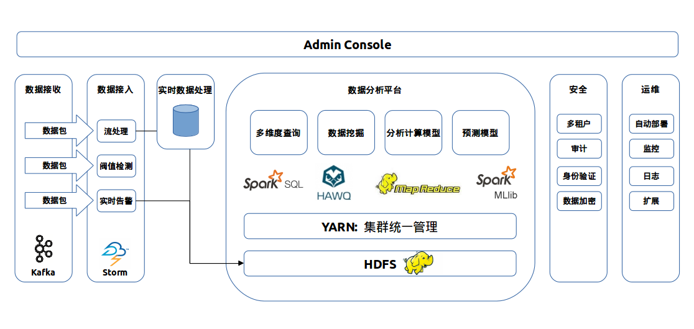
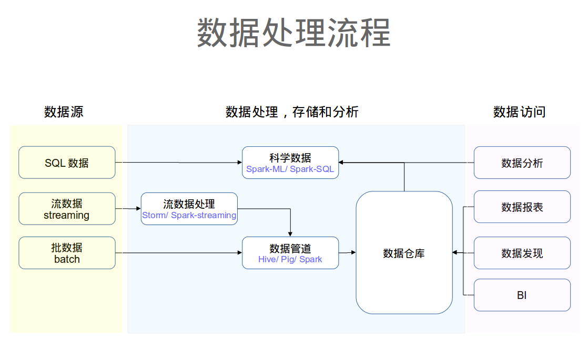
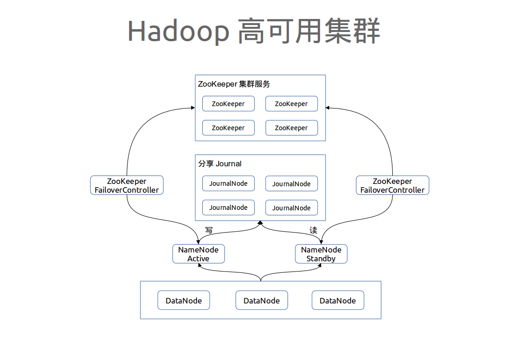
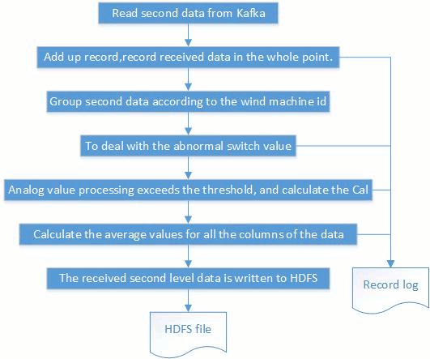

# Data Analytics PoC Deployment Guide

## Architecture Overview

## Business Data Processing Logic

## Hadoop High Availability

## Hardware Setup
* BIOS
* Network Bonding
* SSD hard disk

## Environment Setup
### Disk RAID 0
All 1T * 5 disks
### CentOS 6.7 x86_64
### Disable SELinux
### Partition ext4fs

      [root@poc1 ~]# lsblk    
      NAME   MAJ:MIN RM  SIZE RO TYPE MOUNTPOINT    
      sr0     11:0    1 1024M  0 rom    
      sda      8:0    0  2.2T  0 disk    
      ├─sda1   8:1    0  512M  0 part /boot    
      ├─sda2   8:2    0    8G  0 part [SWAP]    
      ├─sda3   8:3    0 29.3G  0 part /    
      ├─sda4   8:4    0 29.3G  0 part /tmp    
      ├─sda5   8:5    0 29.3G  0 part /var    
      ├─sda6   8:6    0  100G  0 part /usr    
      ├─sda7   8:7    0 19.5G  0 part /data/zookeeper    
      └─sda8   8:8    0    2T  0 part /data    

### Mount Parameter for Performance
To ensure "noatime" param is added when mounting /data and /data/zookeeper

    for i in {1..5}; do ssh nd$i 'echo $HOSTNAME; grep "defaults,noatime" /etc/fstab'; done

### Disk Performance - utilization check
    iostat -p sda -x  

### Hosts    
    cat /etc/hosts

      127.0.0.1   localhost localhost.localdomain localhost4 localhost4.localdomain4     
      ::1         localhost localhost.localdomain localhost6 localhost6.localdomain6

      192.168.210.101 poc1 poc1.esse.io     
      192.168.210.102 poc2 poc2.esse.io     
      192.168.210.103 poc3 poc3.esse.io     
      192.168.210.104 poc4 poc4.esse.io     
      192.168.210.105 poc5 poc5.esse.io     
      192.168.210.106 poc6 poc6.esse.io     

Distribute /etc/hosts to all hosts

    for i in [2..5]; do scp /etc/hosts poc$i:/etc/hosts; done

### Speed up SSHd
Edit /etc/ssh/sshd_config

    UseDNS no   
    GSSAPIAuthentication no     

### Stop Unused Daemons

     for i in 2 3 4 5 6; do ssh poc$i "chkconfig autofs off"; done
     for i in 2 3 4 5 6; do ssh poc$i "chkconfig cups off"; done
     for i in 2 3 4 5 6; do ssh poc$i "chkconfig iptables off"; done

     for i in 2 3 4 5 6; do ssh poc$i "chkconfig ip6tables off"; done
     for i in 2 3 4 5 6; do ssh poc$i "chkconfig netfs off"; done
     for i in 2 3 4 5 6; do ssh poc$i "chkconfig nfslock off"; done
     for i in 2 3 4 5 6; do ssh poc$i "chkconfig postfix off"; done
     for i in 2 3 4 5 6; do ssh poc$i "chkconfig rpcbind off"; done
     for i in 2 3 4 5 6; do ssh poc$i "chkconfig rpcgssd off"; done

     for i in 1 2 3 4 5 6; do ssh poc$i '/etc/init.d/rpcgssd stop; echo $HOSTNAME'; done

### Enable “set -o vi” in /etc/bashrc (optional)
     for i in 1 2 3 4 5 6; do ssh poc$i "echo 'set -o vi' >> /etc/bashrc"; done

Update “transparent_hugepage” in Kernel. Edit /etc/grub.conf and add the following at the end of line quite

    transparent_hugepage=never  

### Update /etc/sysctl.conf
     vm.swappiness=0

[Recommended by Pivotal](http://hawq.docs.pivotal.io/docs-hawq/topics/InstallingHAWQ.html#linux)  

     sysctl.kernel.shmmax = 500000000
     sysctl.kernel.shmmni = 4096
     sysctl.kernel.shmall = 4000000000
     sysctl.kernel.sem = 250 512000 100 2048
     sysctl.kernel.sysrq = 1

     sysctl.kernel.core_uses_pid = 1

     sysctl.kernel.msgmnb = 65536

     sysctl.kernel.msgmax = 65536

     sysctl.kernel.msgmni = 2048
     sysctl.net.ipv4.tcp_syncookies = 0
     sysctl.net.ipv4.ip_forward = 0
     sysctl.net.ipv4.conf.default.accept_source_route = 0
     sysctl.net.ipv4.tcp_tw_recycle = 1
     sysctl.net.ipv4.tcp_max_syn_backlog = 200000
     sysctl.net.ipv4.conf.all.arp_filter = 1
     sysctl.net.ipv4.ip_local_port_range = 1025 65535
     sysctl.net.core.netdev_max_backlog = 200000
     sysctl.vm.overcommit_memory = 2
     sysctl.fs.nr_open = 3000000
     sysctl.kernel.threads-max = 798720
     sysctl.kernel.pid_max = 798720
     #increase network
     sysctl.net.core.rmem_max = 2097152
     sysctl.net.core.wmen_max = 2097152

### Create Local Repos
     yum install createrepo httpd*
     cp $PATH/Packages/* $REPO_PATH/
     cd $REPO_PATH; createrepo .

     ln -s $REPO_PATH /var/www/html/centos_repo

     /etc/init.d/httpd start

     [root@poc1 os_orig_repos]# cat /etc/yum.repos.d/iso.repo
     [iso]
     #baseurl=file:///var/www/html/centos6_repo
     baseurl=http://192.168.210.101/centos6_repo
     enabled=1
     gpgcheck=0

     yum clean all; yum update

Remove original repos and copy repo to all other hosts

     for i in 2 3 4 5 6; do ssh poc$i "mv /etc/yum.repos.d/* /tmp"; done
     for i in 2 3 4 5 6; do scp /etc/yum.repos.d/* poc$i:/etc/yum.repos.d/; done

### Setup NTP on all machines
On NTP Server, edit /etc/ntp.conf

     server poc1.esse.io iburst
     #server 1.centos.pool.ntp.org iburst
     #server 2.centos.pool.ntp.org iburst
     #server 3.centos.pool.ntp.org iburst

     server  127.127.1.0 # local clock
     fudge   127.127.1.0 stratum 10

Distribute ntp.conf to all other NTP client then restart all ntp daemons on all boxes

     chkconfig ntpd on

### Setup Repo
Generally you need to download all pre- requisit of packages for Hortonworks

### JDK
#### Download

     for i in 1 2 3 4 5 6; do ssh poc$i "cd /tmp; wget http://192.168.210.101/repos/java/jdk-8u40-linux-x64.rpm"; done

#### Install JDK

     for i in 1 2 3 4 5 6; do ssh poc$i "cd /tmp; yum localinstall jdk-8u40-linux-x64.rpm -y"; done

#### Create a Softlink

     ln -s /usr/java /usr/jdk64
     for i in 2 3 4 5 6; do ssh poc$i "ln -s /usr/java /usr/jdk64"; done

##  Hortonworks Data Platform Manager Setup
###  Install PostgreSQL and Ambari
####  Install docker-engine

     yum localinstall docker-engine-1.7.1-1.el6.x86_64.rpm
####  Import PostgreSQL and Ambari Images

     [root@poc1 docker-container]# ls
     ambari.tgz  postgresql.tar  zookeeper.tar
     [root@poc1 docker-container]# docker load -i postgresql.tar
     [root@poc1 docker-container]# docker load -i ambari.tgz

     docker run -d --restart=always -v /data/postgresql:/var/lib/postgresql -p 5432:5432 -e DB_NAME=hive_meta,ambari_server -e DB_USER=dbuser -e DB_PASS=$PASSWD --name postgresql sameersbn/postgresql:9.4-2

     Edit /data/postgresql/9.4/main/pg_hba.conf
     host    all       all       192.168.210.0/24           trust

     [root@poc1 ~]# vi /data/postgresql/9.4/main/pg_hba.conf
     [root@poc1 ~]# docker ps -a
     CONTAINER ID        IMAGE                        COMMAND             CREATED             STATUS              PORTS                    NAMES
     7479aca88155        sameersbn/postgresql:9.4-2   "/start"            13 hours ago        Up 28 minutes       0.0.0.0:5432->5432/tcp   postgresql          
     [root@poc1 ~]# docker restart postgresql
     postgresql

#### Install Docker Ambari Container (optional)
     docker run -d -p 8080:8080 -p 8440:8440 -p 8441:8441 --name ambari-server -h ambari-test.esse.io -e POSTGRES_SERVER=192.168.210.101 -e POSTGRES_PORT=5432 -e POSTGRES_DB=ambari_server -e POSTGRES_USER=dbuser -e POSTGRES_PWS=$PASSWD --add-host='poc1.esse.io:192.168.210.101' --add-host='poc2.esse.io:192.168.210.102' --add-host='poc3.esse.io:192.168.210.103' --add-host='poc4.esse.io:192.168.210.104' --add-host='poc5.esse.io:192.168.210.105' --add-host='poc6.esse.io:192.168.210.106' ambari:0.0.1

####  Check Ambari Docker Starting (optional)
     docker logs -tf ambari-server

###  Install Ambari (native and recommended)
#### Edit Repo in Ambari-Server

     [root@docker-ambari yum.repos.d]# cat ambari.repo  

     #VERSION_NUMBER=2.1.2-377
     [Updates-ambari-2.1.2]
     name=ambari-2.1.2 - Updates
     baseurl=http://192.168.210.101/repos/AMBARI-2.1.2/centos6/
     gpgcheck=1
     gpgkey=http://192.168.210.101/repos/AMBARI-2.1.2/centos6/RPM-GPG-KEY/RPM-GPG-KEY-Jenkins
     enabled=1
     priority=A

####  Install Ambari (native and recommended)
     yum install ambari-server

     ambari-server setup -s \
           --database=postgres \
           --databasehost=$POSTGRES_SERVER \
           --databaseport=$POSTGRES_PORT \
           --databasename=$POSTGRES_DB \
           --databaseusername=$POSTGRES_USER \
           --databasepassword=$POSTGRES_PWS \
           --java-home $JAVA_HOME

     [root@poc1 postgresql]# POSTGRES_SERVER=192.168.210.101
     [root@poc1 postgresql]# POSTGRES_DB=ambari_server
     [root@poc1 postgresql]# POSTGRES_USER=dbuser

     psql -d $POSTGRES_DB -h $POSTGRES_SERVER -U $POSTGRES_USER -f /var/lib/ambari-server/resources/Ambari-DDL-Postgres-CREATE.sql

     ambari-server setup --jdbc-db=postgres –jdbc-driver=/data/poc/ARTIFACTS/postgresql-9.4-1201.jdbc4.jar

####  Verify Ambari
     http://192.168.210.101:8080
     -admin:admin

###  Remove Character “\u2028” - Ambari Deployment Issue
During starting Ambari Metrics Collector, the following error may appear if ONLY ONE ZooKeeper broker is installed.

     “UnicodeEncodeError: 'ascii' codec can't encode character u'\u2028' in position 492: ordinal not in range(128)”

Workaround of getting rid of “\u2028”, which is an "Enter"

Check whether “ambari_server” database contains such char

     psql -d ambari_server -h localhost -U dbuser -W -c "select config_id, config_data,type_name from clusterconfig where type_name='ams-site';" > /tmp/test.log

If it does appear (in /tmp/test.log), update the database by [this script](./sql/20151130_update_sql.sql)

Notice: the value of “config_id” might be diff dynamically.

Make sure that the value of “config_date” doesn't contain any of “\u2028” character. Then

     /etc/init.d/ambari-server restart

## Install Hawq
### Hawq Install Pre- requisite

Reference > [http://hawq.docs.pivotal.io/docs-hawq/topics/install-ambari.html](http://hawq.docs.pivotal.io/docs-hawq/topics/install-ambari.html)

#### Advanced hdfs-site Properties

| Property | Settings |
| -------- | -------- |
| dfs.allow.truncate 	| true |
|dfs.support.append | 	true
|dfs.client.read.shortcircuit 	 |true
|dfs.block.local-path-access.user | 	gpadmin
|dfs.datanode.data.dir.perm 	 |750
|dfs.datanode.max.transfer.threads | 	40960
|dfs.datanode.handler.count 	 |60
|dfs.namenode.accesstime.precision | 	-1

#### Advanced core-site Properties

| Property | Setting |
| -------- | ------- |
| ipc.client.connection.maxidletime 	| 3600000
| ipc.client.connect.timeout 	| 300000
| ipc.server.listen.queue.size 	| 3300

#### Advanced hawq-site Properties

Make sure you follow up the instruction at [Advanced hawq-site Properties](http://hawq.docs.pivotal.io/docs-hawq/topics/install-ambari.html)

### Hawq Performance Tuning
#### Install
Create multiple segments during install - [hawq.data.directory](http://hawq.docs.pivotal.io/docs-hawq/topics/install-ambari.html)

#### PostgreSQL
Edit /data/hawq/master/gpseg-1/postgresql.conf, to disable statistics during data load

    gp_autostats_mode=none  

#### Memory
[http://hawq.docs.pivotal.io/docs-hawq/guc_config-gp_vmem_protect_limit.html#gp_vmem_protect_limit](http://hawq.docs.pivotal.io/docs-hawq/guc_config-gp_vmem_protect_limit.html#gp_vmem_protect_limit)

    gpconfig -c gp_vmem_protect_limit -v 8192 -m 21504    

#### HDFS
[Set dfs.block.access.token.enable to false for unsecured HDFS clusters.](http://hawq.docs.pivotal.io/docs-hawq/topics/prepare-hosts.html)

#### Common Causes of Performance Issues
[Common Causes of Performance Issues](http://hawq.docs.pivotal.io/docs-hawq/docs-hawq-shared/admin_guide/perf_issues.html)

### Hawq - Preparing and Adding Nodes
[Document from Pivotal - http://pivotalhd.docs.pivotal.io/doc/...ExpandingtheHAWQSystem-PreparingandAddingNodes](http://pivotalhd-210.docs.pivotal.io/doc/2010/ExpandingtheHAWQSystem.html#ExpandingtheHAWQSystem-PreparingandAddingNodes)

### Hawq Database Re- init (just in- case)

Remove data dir

    rm -fr /data/hawq/segments/* ; rm -fr /data/hawq/master/

Re- initialize Greenplum database in case it's screwed up

    source /usr/local/hawq/greenplum_path.sh; gpinitsystem -a -c /tmp/hawq/gpinitsystem_config -h /tmp/hawq/hostfile -s nd4.esse.io   

## Security
## Hadoop Access Control
[Hadoop ACL](http://hortonworks.com/blog/hdfs-acls-fine-grained-permissions-hdfs-files-hadoop/)

## Integrate Kerberos with Ambari
[Set Up Kerberos for Ambari Server](http://docs.hortonworks.com/HDPDocuments/Ambari-2.1.2.0/bk_Ambari_Security_Guide/content/_optional_set_up_kerberos_for_ambari_server.html)

### Download JCE Security Policy
    http://docs.hortonworks.com/HDPDocuments/Ambari-2.1.1.0/bk_Ambari_Security_Guide/content/_distribute_and_install_the_jce.html

### Apply JCE
    for i in 1 2 3 4 5 6; do ssh poc$i 'echo $HOSTNAME; cd /tmp; unzip -o -j -q jce_policy-8.zip -d /usr/jdk64/jdk1.8.0_40/jre/lib/security/'; done

Restart Ambari-Server

### Install Kerberos
[Follow this instruction](http://docs.hortonworks.com/HDPDocuments/Ambari-2.1.1.0/bk_Ambari_Security_Guide/content/ch_configuring_amb_hdp_for_kerberos.html)

## Sample Code
### [MapReduce Sort](./src/MapReduceSort)

### [Spark Sort](./src/SparkSort)

## Storm Streaming Processing
### Environment
    maven-3.2.5+  
    jdk1.7.0_72+  
    storm-core-0.9.5  
    kafka_2.11-0.8.2.1  

#### Process Description：

  * Client writes 2 hours of real-time data in seconds to the Kafka server (2000000 points / sec)
  * From the Kafka server to read the real-time second data, and add up record numbers, record the whole point of the received data, write to the log
  * Group second data according to the wind machine id, multi-thread processing
  * To deal with the abnormal switch value, record abnormal log
  * To deal with the analog value exceed threshold, record abnormal log, and trigger formula to calculate Cal,write to the log
  * After recieved 2 hours of second data, calculate the average values for all the columns of the data, write to the log
  * The received second data is written to HDFS file, each wind machine to store a file

#### Package and Deploy
  * Execute command: maven clean package，and generate stromtest.jar package
  * Execute command: storm jar stormtest.jar com.ibm.stormtest.topolopy.XXXYYYTopology XXXYYY deploy stormtest.jar to storm topology environment.
  * Check the running situation by storm UI
